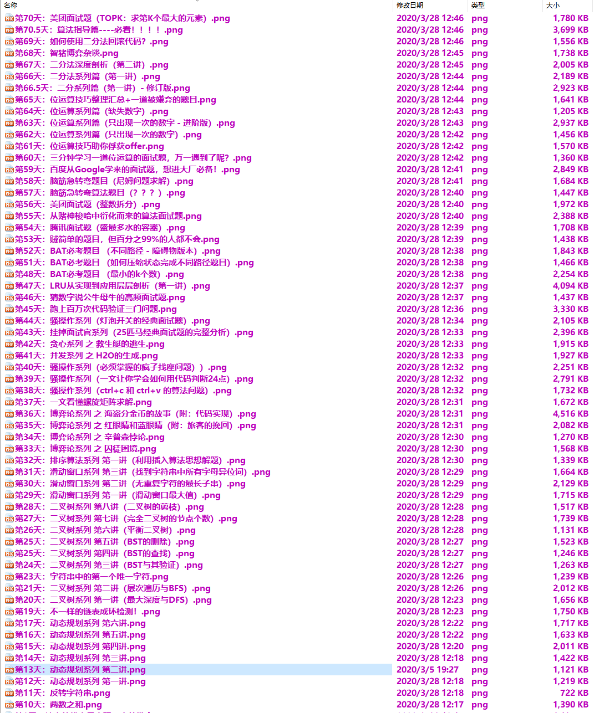

各类编程电子书分类汇总
===================

知识无价 📚有价，为了方便各位找到自己想要的书籍，我对各类编程书籍进行了汇总和整理。

> 同时，向大家推荐一个简单易懂的漫画算法题解汇总，目录如下图所示，有兴趣可以下载。（全文共365篇，非常强大）：

> 扫描下方二维码回复“小浩算法”即可下载:

# java

- Java编程思想 [点击下载](https://pan.baidu.com/s/1oQcpsaPbxZzjqzFT8ffc7A)  密码:pvks
- Java8实战 [点击下载](https://pan.baidu.com/s/1PV4aTFAYU_Sitn9ok-hxDA)    密码:4kc3
- Java核心技术卷I (原书第9版) [点击下载](https://pan.baidu.com/s/1QJ9yLwavzwM2U8flrsa1dg)  密码:l0se
> 其他超全Java高清电子书 [点击下载]()，到上面的公众号回复 1011 获取下载密码。

# 算法

- 数据结构与算法Java版 [点击下载](https://pan.baidu.com/s/158SWu_uGgENDOiYi9vaI9A) 密码:cz2y
- 算法第4版 [点击下载](https://pan.baidu.com/s/1MK5-RH2vTNB3jUxVwVpOXA) 密码:v4ge
> 其他超全算法高清电子书 [点击下载]()，到上面的公众号回复 1031 获取下载密码。

# 设计模式

- 设计模式解析 [点击下载](https://pan.baidu.com/s/1Hnt4E-bjTfOzoYMPuCfRVQ) 密码:gb9y
- 设计模式之禅 [点击下载](https://pan.baidu.com/s/15P2ZlhUE5tTsomwmLYhw8w)  密码:klhe
> 其他超全设计模式学习资料 [点击下载]()，到上面的公众号回复 1021 获取下载密码。

# 正则表达式
- 正则表达式必知必会 [点击下载](https://pan.baidu.com/s/1sCbJ0pDJjNrakkBGL5UeBw) 密码:wzwq
> 其他超全正则表达式学习资料 [点击下载]()，到上面的公众号回复 1041 获取下载密码。

# 数据库
- 七周七数据库 [点击下载](https://pan.baidu.com/s/1NaTTmLAmJ59VnJwYsNp1ig) 密码:h21h
> 其他数据库全部资源 [点击下载]()，到上面的公众号回复 1051 获取下载密码。

# 面试
- java面试宝典 [点击下载](https://pan.baidu.com/s/13KlGkCzWa5Mi6lbqDVbxMw) 密码:qwsm
- 百度人搜，阿里巴巴，腾讯华为小米搜狗笔试面试八十题 [点击下载](https://pan.baidu.com/s/1p_ZWCf7YZ3x-BDMpdvJwHA)  密码:fmw5
> 其他BAT（百度阿里腾讯）、TMD（头条美团滴滴）面筋汇总 [点击下载]()，关注回复 1061 获取下载密码。

# 架构设计
- 支付宝前端架构之路 [点击下载](https://pan.baidu.com/s/1uWxYP6aoUS7rd1Yzqzss8w) 密码:1r8s
- 著名网站设计衍化过程（100篇）[点击下载](https://pan.baidu.com/s/1fX-A_9FmedJVI0QIjutJ7g) 密码:wkyy
> 其他超全架构设计书籍资料 [点击下载]()，关注回复 1071 获取下载密码。

# 多线程并发
- 多线程编程指南 [点击下载](https://pan.baidu.com/s/1qvS81iwdiHu4bdDNrYe1mw) 密码:fq64
- JAVA并发编程实战 [点击下载](https://pan.baidu.com/s/1QexaLZ-EvIvwwPcFS68NKA) 密码:yg3o
> 其他百本高质量并发书籍资料 [点击下载]()，关注回复 1081 获取下载密码。

# 免责声明
书籍全部来源于网络其他人的整理，我这里只是收集整理了他们的链接，如有侵权，马上联系我，我立马删除对应链接。我的邮箱：ththinking@163.com
